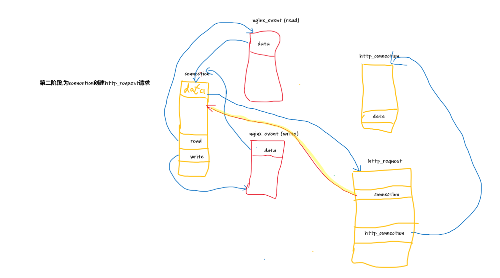

## this is a test page

### one

### 列表
#### 无序号列表
- one
- two
- three
#### 有序号列表
1. AAA
2. BBB
3. CCC
### 图片
1. 图片1

2. 图片2 大小属性
{:height="100" width="100"}

### 折叠

展开查看

<!-- <pre> -->
    哈哈,吓你一跳
<!-- </pre> -->

